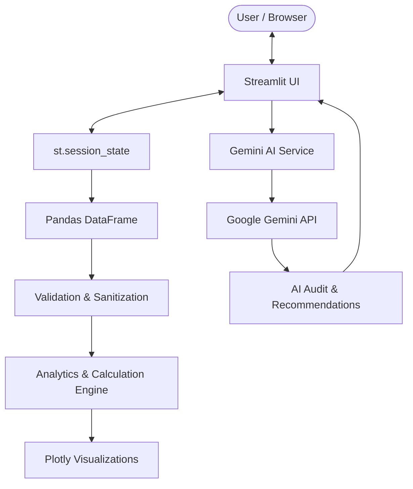

# SubSight AI

> **Understand your subscriptions. Cut the waste.**

SubSight AI is an AI-powered subscription intelligence platform that helps users track recurring expenses, analyze subscription spending, identify potential savings, and receive personalized financial recommendations powered by Google Gemini.

Built as a **B.Tech AI Capstone Project** using Python, Streamlit, Pandas, Plotly, and Google Gemini.

---

## 🌐 Live Application

### Launch SubSight AI

[https://subsightai-ee3yt5pw7l5sjybfzetbdq.streamlit.app/](https://subsightai-ee3yt5pw7l5sjybfzetbdq.streamlit.app/)

### Source Code

[https://github.com/KahkshanAnsari/Subsight.AI](https://github.com/KahkshanAnsari/Subsight.AI)

---

## 📌 Overview

Digital subscriptions are easy to accumulate and surprisingly difficult to monitor.

**SubSight AI** provides a centralized dashboard for understanding recurring subscription expenses and making better financial decisions about what to keep, review, or cancel.

The platform combines:

* Subscription management
* Financial analytics
* Interactive data visualization
* Savings simulation
* AI-powered subscription auditing
* Personalized recommendations

The application is designed around the official **MirAI B.Tech AI Capstone evaluation framework**.

---

# ✨ Key Features

## 📊 Financial Dashboard

Get an instant overview of your complete subscription portfolio.

* Total monthly spending
* Projected annual spending
* Active subscription count
* Potential savings
* Category-wise spending
* Upcoming renewal alerts
* Interactive financial charts
* AI-powered portfolio snapshot

---

## 💳 Subscription Management

Manage recurring subscriptions from a single interface.

* Add subscriptions
* Edit subscription details
* Delete subscriptions
* Search subscriptions
* Filter by category
* Track billing cycles
* Calculate monthly equivalents
* Calculate annual costs
* Export subscription data
* Interactive `st.data_editor`

Subscription data is maintained using Streamlit session state during the active application session.

---

## 🤖 AI Subscription Audit

SubSight AI uses Google Gemini to analyze the user's actual subscription portfolio.

The AI evaluates:

* Overall subscription spending
* High-cost services
* Potentially redundant subscriptions
* Category concentration
* Savings opportunities
* Keep / Review / Cancel recommendations
* Potential alternatives
* Financial optimization opportunities

The AI receives structured, user-specific context instead of functioning as a generic chatbot.

---

## 💰 Savings Simulator

Explore hypothetical cancellation scenarios before making a decision.

Users can:

* Select subscriptions to cancel
* Compare current vs optimized spending
* Calculate monthly savings
* Calculate annual savings
* Visualize financial impact
* Generate AI-assisted scenario analysis

---

## 📈 Portfolio Insights

Understand where recurring spending is going.

Visualizations include:

* Category spending distribution
* Subscription cost comparisons
* Billing-cycle analysis
* Top recurring expenses
* Spending trends
* Renewal insights

Charts are generated from the application's subscription dataset using Plotly.

---

## 🧪 Demo Data

SubSight AI includes a realistic demo dataset for quickly exploring the application.

Example services include:

* Netflix
* Spotify
* YouTube Premium
* Amazon Prime
* Canva
* Google One
* Notion
* Adobe Creative Cloud

The demo dataset allows evaluators to explore the application's analytics and AI features without manually entering subscriptions.

---

# 🏗️ System Architecture



---

# 🔄 Data Flow

```text
User Input
    ↓
Streamlit Form / Data Editor
    ↓
Validation & Sanitization
    ↓
Session State
    ↓
Pandas DataFrame
    ↓
Financial Calculations
    ↓
Analytics & Visualization
    ↓
Gemini AI Context Builder
    ↓
Google Gemini API
    ↓
AI Audit & Recommendations
    ↓
User Dashboard
```

### Processing Flow

1. User enters subscription information.
2. Input is validated and sanitized.
3. Subscription data is maintained using `st.session_state`.
4. Pandas processes the subscription dataset.
5. Monthly and annual costs are calculated.
6. Analytics modules generate spending insights.
7. Plotly renders interactive visualizations.
8. Gemini receives structured, user-specific context.
9. AI generates subscription recommendations.
10. Results are presented through the dashboard.

---

# 🧠 AI Integration

SubSight AI integrates Google's Gemini API through the `google-genai` SDK.

The AI engine is specifically designed for subscription analysis rather than generic conversation.

### Prompt Engineering

The AI integration uses:

* System-level instructions
* Dynamic user context
* Python f-strings
* Structured financial data
* Explicit reasoning constraints
* Recommendation prioritization
* Data-grounded responses

The model is instructed to analyze the information supplied by the application and avoid inventing unsupported subscription prices, usage information, or savings.

---

# 🛠️ Technology Stack

| Technology     | Purpose                                |
| -------------- | -------------------------------------- |
| Python 3.11+   | Core application logic                 |
| Streamlit      | Web application framework              |
| Pandas         | Data processing                        |
| Plotly         | Interactive data visualization         |
| Google Gemini  | AI analysis and recommendations        |
| `google-genai` | Gemini API integration                 |
| Git            | Version control                        |
| GitHub         | Source control and open-source hosting |

---

# 📁 Project Structure

```text
Subsight.AI/
│
├── app.py
├── requirements.txt
├── README.md
├── LICENSE
├── .gitignore
│
├── .streamlit/
│   └── config.toml
│
├── components/
│   ├── sidebar.py
│   ├── cards.py
│   ├── charts.py
│   └── tables.py
│
├── services/
│   ├── gemini_service.py
│   └── analytics.py
│
├── utils/
│   ├── calculations.py
│   ├── validators.py
│   └── config.py
│
└── assets/
    └── logo.svg
```

---

# 🚀 Local Installation

## Prerequisites

* Python 3.11 or newer
* Git
* Google Gemini API key

## 1. Clone the Repository

```bash
git clone https://github.com/KahkshanAnsari/Subsight.AI.git
cd Subsight.AI
```

## 2. Install Dependencies

```bash
pip install -r requirements.txt
```

## 3. Configure Gemini API

Create:

```text
.streamlit/secrets.toml
```

Add:

```toml
GEMINI_API_KEY = "YOUR_GEMINI_API_KEY"
```

> **Important:** Never commit `secrets.toml`, `.env` files, or API keys to GitHub.

## 4. Run the Application

```bash
python -m streamlit run app.py
```

The application will be available at:

```text
http://localhost:8501
```

---

# ☁️ Deployment

SubSight AI is deployed using **Streamlit Community Cloud**.

### Deployment Configuration

| Setting      | Value                        |
| ------------ | ---------------------------- |
| Repository   | `KahkshanAnsari/Subsight.AI` |
| Branch       | `main`                       |
| Main File    | `app.py`                     |
| Dependencies | `requirements.txt`           |
| Platform     | Streamlit Community Cloud    |

### Live Deployment

[https://subsightai-ee3yt5pw7l5sjybfzetbdq.streamlit.app/](https://subsightai-ee3yt5pw7l5sjybfzetbdq.streamlit.app/)

---

# 🔐 Security & Secrets

API credentials are not stored directly in the source code.

The application uses Streamlit secrets for deployment configuration.

Sensitive files such as:

```text
.streamlit/secrets.toml
.env
```

are excluded from version control.

For Streamlit Community Cloud, credentials are configured through the application's **Secrets** settings.

---

# 🔒 Authentication & Database (v2.0)

SubSight AI v2.0 adds real user authentication and persistent subscription storage powered by **Supabase**.

## Authentication Architecture

```text
User enters email + password
        ↓
Supabase Auth (email/password provider)
        ↓
JWT access token returned
        ↓
Token stored in st.session_state["access_token"]
        ↓
All database queries sent with JWT in Authorization header
        ↓
PostgreSQL Row Level Security binds auth.uid() to user_id
        ↓
Users can only access their own rows
```

Passwords are **never stored in our database**. They are managed exclusively by Supabase Auth.

## Database Schema

The `subscriptions` table stores one row per subscription per user:

| Column | Type | Notes |
| --- | --- | --- |
| `id` | TEXT (PK) | App-generated `sub_xxxxxxxx` format |
| `user_id` | UUID (FK) | References `auth.users(id)` — ON DELETE CASCADE |
| `name` | TEXT | Subscription service name |
| `price` | NUMERIC(12,2) | Billing price |
| `billing_cycle` | TEXT | Monthly / Quarterly / Yearly |
| `category` | TEXT | Entertainment / Productivity / etc. |
| `currency` | TEXT | INR (₹) / USD ($) / etc. |
| `renewal_date` | DATE | Next renewal date |
| `status` | TEXT | Active / Review Needed / Paused / Cancelled |
| `created_at` | TIMESTAMPTZ | Auto-set on INSERT |
| `updated_at` | TIMESTAMPTZ | Auto-updated via trigger |

## Row Level Security (RLS)

RLS is enabled on the `subscriptions` table with four policies:

| Operation | Policy |
| --- | --- |
| SELECT | `auth.uid() = user_id` |
| INSERT | `auth.uid() = user_id` |
| UPDATE | `auth.uid() = user_id` (both USING and WITH CHECK) |
| DELETE | `auth.uid() = user_id` |

A user **cannot read, write, update, or delete** another user's subscription data — even with a valid JWT.

## Supabase Setup

### 1. Create a Supabase Project

1. Go to [supabase.com](https://supabase.com) and create a free account.
2. Create a new project and note the **Project URL** and **anon/public key**.

### 2. Run the Database Schema

1. Open the Supabase Dashboard → **SQL Editor** → **New query**.
2. Paste the contents of `supabase/schema.sql` and click **Run**.

### 3. Configure Streamlit Secrets

**Local development** — add to `.streamlit/secrets.toml`:

```toml
GEMINI_API_KEY = "your-gemini-api-key"
SUPABASE_URL   = "https://your-project-ref.supabase.co"
SUPABASE_KEY   = "your-anon-public-key"
```

**Streamlit Community Cloud** — add to **App Settings → Secrets**:

```toml
GEMINI_API_KEY = "your-gemini-api-key"
SUPABASE_URL   = "https://your-project-ref.supabase.co"
SUPABASE_KEY   = "your-anon-public-key"
```

> **Important:** Use the **anon/public key**, not the service role key. RLS enforces security at the database level.

## Application Flow

```text
Unauthenticated user
        ↓
Authentication screen (Login / Sign Up tabs)
        ↓
Supabase Auth validates credentials
        ↓
JWT stored in st.session_state
        ↓
Fetch user's subscriptions from Supabase
        ↓
Existing SubSight AI dashboard loads
        ↓
Add / Edit / Delete operations sync to Supabase + session_state
        ↓
Logout clears session state → returns to auth screen
```

## Updated Project Structure (v2.0)

```text
Subsight.AI/
│
├── app.py                    ← Auth guard + Supabase wiring added
├── requirements.txt          ← supabase>=2.0.0 added
├── README.md
│
├── .streamlit/
│   ├── config.toml
│   └── secrets.toml          ← SUPABASE_URL + SUPABASE_KEY added
│
├── supabase/
│   └── schema.sql            ← NEW: Complete DB schema with RLS
│
├── components/
│   ├── auth_ui.py            ← NEW: Login / Sign Up screen
│   ├── sidebar.py            ← Account section + logout added
│   ├── cards.py
│   ├── charts.py
│   └── tables.py
│
├── services/
│   ├── supabase_service.py   ← NEW: All Supabase auth + CRUD logic
│   ├── gemini_service.py
│   └── analytics.py
│
├── utils/
│   ├── calculations.py
│   ├── validators.py
│   └── config.py
│
└── assets/
    └── logo.svg
```

---

# 📋 Capstone Evaluation Framework

The project is developed according to the official **MirAI B.Tech AI Capstone evaluation framework**.

| Evaluation Category                 | Maximum Points |
| ----------------------------------- | -------------: |
| Technical Architecture              |             25 |
| AI Integration & Prompt Engineering |             20 |
| UI/UX & Data Visualization          |             20 |
| Deployment & Cloud Engineering      |             15 |
| Open-Source GitHub Branding         |             10 |
| System Design & Documentation       |             10 |
| **Total**                           |        **100** |

### 1. Technical Architecture — 25 Points

Implemented concepts include:

* `st.session_state`
* `st.form`
* Pandas DataFrames
* Modular Python architecture
* Input validation
* Data sanitization
* Error handling

### 2. AI Integration & Prompt Engineering — 20 Points

Implemented concepts include:

* Google Gemini API
* System instructions
* Dynamic context construction
* f-string based prompts
* Data-grounded recommendations
* Specialized subscription analysis

### 3. UI/UX & Data Visualization — 20 Points

Implemented concepts include:

* Professional light-theme interface
* KPI metric cards
* Dynamic metric deltas
* Column-based layouts
* Expanders
* Interactive data editor
* Plotly visualizations
* Search and filtering
* Responsive application states

### 4. Deployment & Cloud Engineering — 15 Points

Implemented concepts include:

* Streamlit Community Cloud deployment
* GitHub-based source deployment
* `requirements.txt`
* Streamlit configuration
* Secure secrets management

### 5. Open-Source Branding — 10 Points

The repository includes:

* Professional README
* Architecture documentation
* Setup instructions
* Deployment instructions
* Technology documentation
* Live application link
* GitHub repository

### 6. System Design & Documentation — 10 Points

Documentation covers:

* System architecture
* Data flow
* AI integration strategy
* Application modules
* Data validation
* Analytics pipeline
* Deployment architecture

> **Note:** The point values above represent the official evaluation weightage. Final scores are determined by the evaluator.

---

# 🧩 Core Modules

### `app.py`

Main Streamlit application entry point and page routing.

### `components/`

Contains reusable UI components:

* Sidebar
* Metric cards
* Charts
* Tables
* Navigation elements

### `services/`

Contains application services:

* Gemini AI integration
* Analytics processing
* AI prompt construction

### `utils/`

Contains reusable utilities:

* Financial calculations
* Data validation
* Configuration
* Data sanitization

---

# 📊 Financial Calculations

SubSight AI normalizes subscription costs across different billing cycles.

Examples:

```text
Monthly subscription
→ Monthly cost = Price

Quarterly subscription
→ Monthly equivalent = Price / 3

Yearly subscription
→ Monthly equivalent = Price / 12
```

Annual projections are calculated from normalized monthly spending.

This allows subscriptions with different billing cycles to be compared consistently.

---

# 🔎 Data Validation

User-entered subscription data is validated before processing.

Validation covers:

* Subscription name
* Price
* Billing cycle
* Category
* Renewal date
* Subscription status
* Required fields

This helps prevent invalid values from affecting financial calculations and visualizations.

---

# 📈 Application Workflow

```text
                    ┌───────────────────┐
                    │       User        │
                    └─────────┬─────────┘
                              │
                              ▼
                    ┌───────────────────┐
                    │   Streamlit UI    │
                    └─────────┬─────────┘
                              │
                              ▼
                    ┌───────────────────┐
                    │ Subscription Data │
                    └─────────┬─────────┘
                              │
                 ┌────────────┴────────────┐
                 ▼                         ▼
        ┌─────────────────┐       ┌─────────────────┐
        │    Analytics    │       │    Gemini AI    │
        │     Engine      │       │     Service     │
        └────────┬────────┘       └────────┬────────┘
                 │                         │
                 ▼                         ▼
        ┌─────────────────┐       ┌─────────────────┐
        │  Charts & KPIs  │       │    AI Audit     │
        └────────┬────────┘       └────────┬────────┘
                 │                         │
                 └────────────┬────────────┘
                              ▼
                    ┌───────────────────┐
                    │   User Insights   │
                    └───────────────────┘
```

---

# 🔮 Future Enhancements

Potential future improvements include:

* Persistent cloud database
* User authentication
* Historical spending tracking
* Automated renewal notifications
* Subscription usage tracking
* Bank statement integration
* Advanced AI recommendations
* Mobile-optimized experience
* Email notification system

---

# 📜 License

This project is distributed under the **MIT License**.

See the `LICENSE` file for details.

---

# 👩‍💻 Project

## SubSight AI

**B.Tech AI Capstone Project**

Built with:

**Python · Streamlit · Pandas · Plotly · Google Gemini**

---

<p align="center">

**[🌐 Live App](https://subsightai-ee3yt5pw7l5sjybfzetbdq.streamlit.app/) · [💻 GitHub](https://github.com/KahkshanAnsari/Subsight.AI)**

</p>
