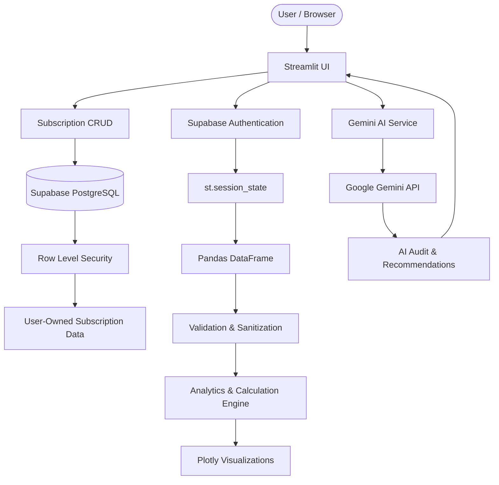

# SubSight AI

> **Understand your subscriptions. Cut the waste.**

SubSight AI is a premium AI-powered subscription intelligence platform that helps users track recurring expenses, understand spending patterns, identify potential savings, monitor renewals, and receive personalized financial recommendations powered by Google Gemini.

Built as a **B.Tech AI Capstone Project** using Python, Streamlit, Pandas, Plotly, Google Gemini, and Supabase.

---

## 🌐 Live Application

### Launch SubSight AI

[https://subsightai-ee3yt5pw7l5sjybfzetbdq.streamlit.app/](https://subsightai-ee3yt5pw7l5sjybfzetbdq.streamlit.app/)

### Source Code

[https://github.com/KahkshanAnsari/Subsight.AI](https://github.com/KahkshanAnsari/Subsight.AI)

---

## 📌 Overview

Digital subscriptions are easy to accumulate and surprisingly difficult to monitor.

**SubSight AI** provides a centralized personal workspace for understanding recurring subscription expenses and making better financial decisions about what to keep, review, or cancel.

The platform combines:

* Personal user accounts
* Persistent subscription storage
* Subscription management
* Financial analytics
* Renewal tracking
* Interactive data visualization
* Savings simulation
* AI-powered subscription auditing
* Personalized recommendations
* Secure user-level data isolation

Each user gets their own subscription portfolio. Data is persisted using Supabase and protected using PostgreSQL Row Level Security.

---

# ✨ Key Features

## 👤 User Authentication

SubSight AI provides a real account-based experience using Supabase Authentication.

Users can:

* Create an account
* Log in securely
* Log out
* Access their personal subscription portfolio
* Return later and retrieve previously saved subscriptions

Passwords are handled by Supabase Auth and are not manually stored by the application.

---

## 💾 Persistent Subscription Storage

Subscription data is stored in a cloud PostgreSQL database through Supabase.

Unlike a session-only demo, subscriptions remain available when the user:

* Refreshes the application
* Logs out
* Logs back in
* Returns to the application later

Each subscription is associated with the authenticated user's unique ID.

PostgreSQL Row Level Security ensures that users can only access their own subscription records.

---

## 📊 Financial Dashboard

Get an instant overview of your complete subscription portfolio.

* Total monthly spending
* Projected annual spending
* Active subscription count
* Potential savings
* Category-wise spending
* Upcoming renewal alerts
* Interactive financial charts
* AI-powered portfolio snapshot

The dashboard dynamically reflects the authenticated user's subscription data.

---

## 💳 Subscription Management

Manage recurring subscriptions from a single interface.

* Add subscriptions
* Edit subscription details
* Delete subscriptions
* Search subscriptions
* Filter by category
* Track billing cycles
* Calculate monthly equivalents
* Calculate annual costs
* Track renewal dates
* Track subscription status
* Export subscription data
* Interactive `st.data_editor`

Supported billing cycles:

* Monthly
* Quarterly
* Yearly

---

## 📅 Renewal Tracking

SubSight AI helps users understand upcoming subscription renewals.

Users can see:

* Next renewal date
* Upcoming renewals
* Subscription status
* Time remaining before renewal
* Renewal-related spending

This makes it easier to review subscriptions before another billing cycle begins.

---

## 🤖 AI Subscription Audit

SubSight AI uses Google Gemini to analyze the user's actual subscription portfolio.

The AI evaluates:

* Overall subscription spending
* High-cost services
* Potentially redundant subscriptions
* Category concentration
* Savings opportunities
* Keep / Review / Cancel recommendations
* Potential alternatives
* Financial optimization opportunities

The AI receives structured, user-specific financial context rather than functioning as a generic chatbot.

### AI Engineering

The AI integration uses:

* System-level instructions
* Dynamic user context
* Python f-strings
* Structured financial data
* Explicit reasoning constraints
* Recommendation prioritization
* Data-grounded responses

The model is instructed to reason from the user's supplied data and avoid inventing unsupported subscription prices, usage information, or savings.

---

## 💰 Savings Simulator

Explore hypothetical cancellation scenarios before making a decision.

Users can:

* Select subscriptions to cancel
* Compare current vs optimized spending
* Calculate monthly savings
* Calculate annual savings
* Visualize financial impact
* Generate AI-assisted scenario analysis

The simulator helps answer:

> “What happens to my yearly spending if I cancel these subscriptions?”

---

## 📈 Portfolio Insights

Understand where recurring spending is going.

Visualizations include:

* Category spending distribution
* Subscription cost comparisons
* Billing-cycle analysis
* Top recurring expenses
* Spending trends
* Renewal insights

Charts are generated from the authenticated user's subscription dataset using Plotly.

---

## 🧪 Demo Data

SubSight AI includes realistic demo data so evaluators and new users can immediately explore the platform.

Example services include:

* Netflix
* Spotify
* YouTube Premium
* Amazon Prime
* Canva
* Google One
* Notion
* Adobe Creative Cloud

Demo data is loaded only when the user explicitly chooses the **Load Demo** action.

Demo records are associated with the currently authenticated user and do not expose another user's data.

---

# 🏗️ System Architecture



---

# 🔄 Authentication & Data Flow

```text
User
  ↓
Login / Sign Up
  ↓
Supabase Auth
  ↓
Authenticated Session
  ↓
User ID
  ↓
st.session_state
  ↓
Fetch User's Subscriptions
  ↓
Pandas DataFrame
  ↓
Analytics + Visualizations
  ↓
Gemini AI Context
  ↓
AI Audit / Recommendations
```

### Subscription Save Flow

```text
User adds subscription
        ↓
Streamlit Form
        ↓
Input Validation
        ↓
Authenticated User ID
        ↓
Supabase PostgreSQL
        ↓
RLS verifies ownership
        ↓
Subscription stored
        ↓
Session State updated
        ↓
Dashboard recalculated
```

---

# 🔐 Security Architecture

SubSight AI uses Supabase Authentication and PostgreSQL Row Level Security.

### Authentication

Supabase manages:

* User accounts
* Password handling
* Authentication sessions
* User identity

The application does not manually store user passwords.

### Row Level Security

The `subscriptions` table uses RLS policies based on:

```text
auth.uid() = user_id
```

This means an authenticated user can only:

* Read their own subscriptions
* Insert their own subscriptions
* Update their own subscriptions
* Delete their own subscriptions

Even if another user's subscription ID is known, the RLS policy prevents unauthorized access.

---

# 🗄️ Database Schema

The application uses a PostgreSQL `subscriptions` table.

| Column          | Type        | Description                                 |
| --------------- | ----------- | ------------------------------------------- |
| `id`            | TEXT        | Application-generated subscription ID       |
| `user_id`       | UUID        | Authenticated Supabase user ID              |
| `name`          | TEXT        | Subscription service name                   |
| `price`         | NUMERIC     | Subscription price                          |
| `billing_cycle` | TEXT        | Monthly / Quarterly / Yearly                |
| `category`      | TEXT        | Subscription category                       |
| `currency`      | TEXT        | Currency                                    |
| `renewal_date`  | DATE        | Next renewal date                           |
| `status`        | TEXT        | Active / Review Needed / Paused / Cancelled |
| `created_at`    | TIMESTAMPTZ | Creation timestamp                          |
| `updated_at`    | TIMESTAMPTZ | Last update timestamp                       |

Database schema and RLS policies are defined in:

```text
supabase/schema.sql
```

---

# 🛠️ Technology Stack

| Technology                | Purpose                                |
| ------------------------- | -------------------------------------- |
| Python 3.11+              | Core application logic                 |
| Streamlit                 | Web application framework              |
| Pandas                    | Data processing                        |
| Plotly                    | Interactive data visualization         |
| Google Gemini             | AI analysis and recommendations        |
| `google-genai`            | Gemini API integration                 |
| Supabase Auth             | User authentication                    |
| PostgreSQL                | Persistent database                    |
| Supabase RLS              | User-level data security               |
| Git                       | Version control                        |
| GitHub                    | Source control and open-source hosting |
| Streamlit Community Cloud | Cloud deployment                       |

---

# 📁 Project Structure

```text
Subsight.AI/
│
├── app.py
├── requirements.txt
├── README.md
├── LICENSE
├── .gitignore
│
├── .streamlit/
│   └── config.toml
│
├── supabase/
│   └── schema.sql
│
├── components/
│   ├── auth_ui.py
│   ├── sidebar.py
│   ├── cards.py
│   ├── charts.py
│   └── tables.py
│
├── services/
│   ├── supabase_service.py
│   ├── gemini_service.py
│   └── analytics.py
│
├── utils/
│   ├── calculations.py
│   ├── validators.py
│   └── config.py
│
└── assets/
    └── logo.svg
```

---

# 🚀 Local Installation

## Prerequisites

* Python 3.11+
* Git
* Supabase account
* Google Gemini API key

---

## 1. Clone the Repository

```bash
git clone https://github.com/KahkshanAnsari/Subsight.AI.git
cd Subsight.AI
```

---

## 2. Install Dependencies

```bash
pip install -r requirements.txt
```

---

## 3. Configure Supabase

Create a Supabase project.

Then open:

```text
Supabase Dashboard
→ SQL Editor
→ New Query
```

Copy the contents of:

```text
supabase/schema.sql
```

Paste them into the SQL Editor and run the script.

This creates:

* `subscriptions` table
* indexes
* RLS
* RLS policies
* `updated_at` trigger

---

## 4. Configure Local Secrets

Create:

```text
.streamlit/secrets.toml
```

Add:

```toml
GEMINI_API_KEY = "your-gemini-api-key"

SUPABASE_URL = "https://your-project-ref.supabase.co"

SUPABASE_KEY = "your-anon-public-key"
```

### Security

Never commit:

```text
.streamlit/secrets.toml
.env
```

to GitHub.

Never expose your Supabase service-role key or Gemini API key publicly.

---

## 5. Run the Application

```bash
python -m streamlit run app.py
```

The application will be available at:

```text
http://localhost:8501
```

---

# ☁️ Deployment

SubSight AI is deployed using **Streamlit Community Cloud**.

### Deployment Configuration

| Setting      | Value                        |
| ------------ | ---------------------------- |
| Repository   | `KahkshanAnsari/Subsight.AI` |
| Branch       | `main`                       |
| Main File    | `app.py`                     |
| Dependencies | `requirements.txt`           |
| Platform     | Streamlit Community Cloud    |

### Streamlit Cloud Secrets

For the deployed application, configure secrets through:

```text
Streamlit Cloud
→ App Settings
→ Secrets
```

Use:

```toml
GEMINI_API_KEY = "your-gemini-api-key"

SUPABASE_URL = "https://your-project-ref.supabase.co"

SUPABASE_KEY = "your-anon-public-key"
```

Do not put production credentials inside the GitHub repository.

---

# 🔒 Security & Secrets

API credentials are not hardcoded into the source code.

The application uses Streamlit Secrets for runtime configuration.

Sensitive configuration is excluded from version control.

The application follows a user-isolated data model:

```text
Authenticated User
        ↓
Supabase Auth
        ↓
User ID
        ↓
subscriptions.user_id
        ↓
PostgreSQL RLS
        ↓
Only user's records
```

---

# 📊 Financial Calculations

SubSight AI normalizes subscription costs across different billing cycles.

```text
Monthly subscription
→ Monthly cost = Price

Quarterly subscription
→ Monthly equivalent = Price / 3

Yearly subscription
→ Monthly equivalent = Price / 12
```

Annual projections are calculated from normalized monthly spending.

This allows subscriptions with different billing cycles to be compared consistently.

---

# 🔎 Data Validation

User-entered subscription data is validated before processing.

Validation covers:

* Subscription name
* Price
* Billing cycle
* Category
* Renewal date
* Subscription status
* Required fields

This helps prevent invalid values from affecting financial calculations and visualizations.

---

# 📋 Capstone Evaluation Framework

The project is developed according to the official **MirAI B.Tech AI Capstone evaluation framework**.

| Evaluation Category                 | Maximum Points |
| ----------------------------------- | -------------: |
| Technical Architecture              |             25 |
| AI Integration & Prompt Engineering |             20 |
| UI/UX & Data Visualization          |             20 |
| Deployment & Cloud Engineering      |             15 |
| Open-Source GitHub Branding         |             10 |
| System Design & Documentation       |             10 |
| **Total**                           |        **100** |

### 1. Technical Architecture — 25 Points

Implemented concepts include:

* `st.session_state`
* `st.form`
* Pandas DataFrames
* Modular Python architecture
* Supabase persistence
* PostgreSQL database
* Row Level Security
* Input validation
* Data sanitization
* Error handling

### 2. AI Integration & Prompt Engineering — 20 Points

Implemented concepts include:

* Google Gemini API
* System instructions
* Dynamic context construction
* f-string based prompts
* Structured financial context
* Data-grounded recommendations
* Specialized subscription analysis

### 3. UI/UX & Data Visualization — 20 Points

Implemented concepts include:

* Premium light-theme interface
* KPI metric cards
* Dynamic metric deltas
* Column-based layouts
* Expanders
* Interactive data editor
* Plotly visualizations
* Search and filtering
* Responsive authentication experience

### 4. Deployment & Cloud Engineering — 15 Points

Implemented concepts include:

* Streamlit Community Cloud
* GitHub-based deployment
* `requirements.txt`
* Streamlit configuration
* Secure secrets management
* Supabase cloud database

### 5. Open-Source GitHub Branding — 10 Points

The repository includes:

* Professional README
* Architecture documentation
* Setup instructions
* Deployment instructions
* Database documentation
* Live application link
* GitHub repository

### 6. System Design & Documentation — 10 Points

Documentation covers:

* System architecture
* Authentication flow
* Database architecture
* RLS security model
* Data flow
* AI integration strategy
* Application modules
* Data validation
* Deployment architecture

> **Note:** The point values above represent the official evaluation weightage. Final scores are determined by the evaluator.

---

# 🧩 Core Modules

### `app.py`

Main Streamlit application entry point, authentication guard, routing, and application orchestration.

### `components/`

Reusable presentation components:

* Authentication UI
* Sidebar
* Metric cards
* Charts
* Tables
* Navigation elements

### `services/`

Application services:

* Supabase authentication
* Subscription CRUD
* Gemini AI integration
* Analytics processing
* AI prompt construction

### `utils/`

Reusable utilities:

* Financial calculations
* Data validation
* Configuration
* Data sanitization

### `supabase/schema.sql`

Database definition including:

* Subscription table
* Foreign key relationship
* Indexes
* Row Level Security
* Security policies
* Automatic update trigger

---

# 🔄 Application Workflow

```text
                    ┌────────────────────┐
                    │        User        │
                    └─────────┬──────────┘
                              │
                              ▼
                    ┌────────────────────┐
                    │   Authentication   │
                    │    Supabase Auth   │
                    └─────────┬──────────┘
                              │
                              ▼
                    ┌────────────────────┐
                    │  Streamlit Session │
                    │    st.session_state│
                    └─────────┬──────────┘
                              │
                              ▼
                    ┌────────────────────┐
                    │   Subscription     │
                    │       Data         │
                    └─────────┬──────────┘
                              │
                 ┌────────────┴────────────┐
                 ▼                         ▼
        ┌─────────────────┐       ┌─────────────────┐
        │    Supabase     │       │    Analytics    │
        │   PostgreSQL    │       │     Engine      │
        └────────┬────────┘       └────────┬────────┘
                 │                         │
                 ▼                         ▼
        ┌─────────────────┐       ┌─────────────────┐
        │       RLS       │       │ Charts & KPIs  │
        └─────────────────┘       └─────────────────┘
                                          
                              │
                              ▼
                    ┌────────────────────┐
                    │    Gemini AI       │
                    │   Audit Engine     │
                    └─────────┬──────────┘
                              │
                              ▼
                    ┌────────────────────┐
                    │  User Insights &   │
                    │  Recommendations   │
                    └────────────────────┘
```

---

# 🚀 Current Product Capabilities

SubSight AI currently provides:

* Account creation
* Secure login
* Logout
* Persistent cloud subscription storage
* User-specific data isolation
* Subscription CRUD
* Renewal tracking
* Financial dashboard
* Interactive analytics
* AI subscription auditing
* Savings simulation
* Portfolio insights
* Demo data
* CSV export
* Gemini-powered recommendations
* Streamlit Cloud deployment

---

# 🔮 Future Enhancements

Potential future improvements include:

* Automated renewal notifications
* Subscription usage tracking
* Historical spending comparisons
* Email notification system
* Bank statement integration
* Subscription receipt scanning
* Advanced AI financial forecasting
* Mobile-optimized experience
* Multi-currency analytics
* Personalized monthly financial reports

---

# 📜 License

This project is distributed under the **MIT License**.

See the `LICENSE` file for details.

---

# 👩‍💻 Project

## SubSight AI

**B.Tech AI Capstone Project**

Built with:

**Python · Streamlit · Pandas · Plotly · Google Gemini · Supabase**

---

<p align="center">

**🌐 Live App:**
[https://subsightai-ee3yt5pw7l5sjybfzetbdq.streamlit.app/](https://subsightai-ee3yt5pw7l5sjybfzetbdq.streamlit.app/)

**💻 GitHub:**
[https://github.com/KahkshanAnsari/Subsight.AI](https://github.com/KahkshanAnsari/Subsight.AI)

</p>
