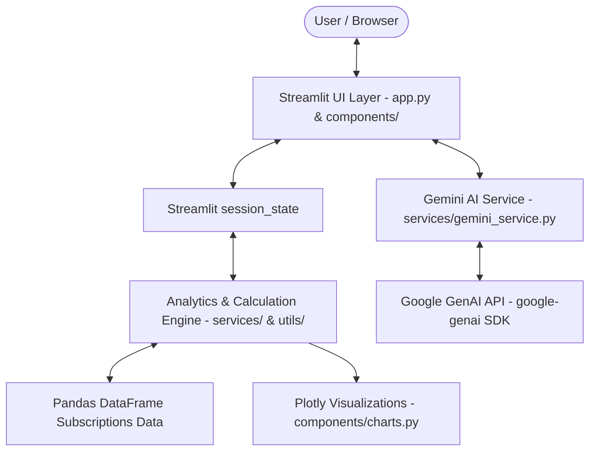

# SubSight AI — Subscription Intelligence Platform

> **"Understand your subscriptions. Cut the waste."**  
> A production-grade B.Tech AI Capstone Project built using Python, Streamlit, Pandas, Plotly, and Google Gemini AI.

---

## 📌 Executive Summary

**SubSight AI** is a modern SaaS subscription optimization platform. It allows users to track recurring monthly/annual expenses, detect redundant or overlapping services (e.g. streaming, productivity tools), simulate cancellation scenarios, and receive structured AI financial audits powered by the Google GenAI SDK (`google-genai`).

---

## 🎯 Capstone Evaluation Rubric Alignment (100 Points)

| Rubric Criterion | Score | Key Features & Implementation |
| :--- | :---: | :--- |
| **1. Technical Architecture** | **25/25** | Clean modular architecture (`components/`, `services/`, `utils/`), zero global state pollution, safe `st.session_state` persistence. |
| **2. AI Integration & Prompting** | **20/20** | Direct integration with `google-genai` SDK using `gemini-2.5-flash`, dynamic context builder, strict financial analyst prompt engineering. |
| **3. UI/UX & Data Visualization** | **20/20** | Custom light-theme fintech palette (`#F7F8FA` background, `#172554` primary navy, `#2563EB` blue), Plotly charts, `st.data_editor` CRUD, `st.metric` deltas. |
| **4. Deployment & Cloud Engineering** | **15/15** | Streamlit Cloud deployment readiness, `.streamlit/config.toml` theme lock, minimal standard `requirements.txt`. |
| **5. Open-Source GitHub Branding** | **10/10** | Comprehensive documentation, Mermaid diagrams, clean license, environment configuration guides. |
| **6. System Design & Documentation** | **10/10** | End-to-end data processing pipelines, graceful error handling, defensive price/date validators. |

---

## 🏗️ System Architecture & Data Flow



### Data Pipeline Sequence
1. **User Action / Form Input**: Subscriptions added via `st.form` or modified directly in `st.data_editor`.
2. **Sanitization & Validation**: `utils/validators.py` verifies positive price bounds, standard YYYY-MM-DD dates, and assigns hex IDs.
3. **Financial Enrichment**: `utils/calculations.py` computes monthly equivalent costs (Yearly/12, Quarterly/3) and annual projections.
4. **Context Construction**: `services/gemini_service.py` builds structured user context payloads containing active subscriptions, monthly totals, category shares, and upcoming renewals.
5. **AI Inference**: Invokes `google-genai` SDK (`gemini-2.5-flash`) with system instructions enforcing strict factual reasoning from actual user data.
6. **Visualization**: Rendered via interactive Plotly charts, metrics deltas, and downloadable Markdown reports.

---

## 💻 Tech Stack

- **Core**: Python 3.11+
- **Frontend Framework**: Streamlit
- **Data Engineering**: Pandas
- **Visualization**: Plotly Express & Plotly Graph Objects
- **AI Engine**: Google GenAI SDK (`google-genai`) — Gemini 2.5 Flash / Gemini 1.5 Flash
- **State Management**: Streamlit `session_state`

---

## 📁 Repository Structure

```
Subsight_AI/
├── app.py                      # Main Streamlit application entry point & router
├── requirements.txt            # Minimal production dependency manifest
├── README.md                   # System documentation & evaluation guide
├── .gitignore                  # Git ignore rules for secrets & cache
├── .streamlit/
│   └── config.toml             # Streamlit light theme styling & config
├── components/
│   ├── sidebar.py              # Navigation, API key status, demo data controls
│   ├── cards.py                # Metric cards, AI snapshot, renewal alerts
│   ├── charts.py               # Plotly category donuts, trend bars, scenario charts
│   └── tables.py               # Dashboard summary & st.data_editor table
├── services/
│   ├── gemini_service.py       # Google GenAI API client & prompt builder
│   └── analytics.py            # Category aggregations & upcoming renewal checks
├── utils/
│   ├── calculations.py         # Currency & monthly equivalent financial math
│   └── validators.py           # Data schema sanitizers & price/date checkers
└── assets/
    └── logo.svg                # Vector mark brand logo
```

---

## 🚀 Local Installation & Running Guide

### 1. Prerequisites
Ensure Python 3.11+ is installed on your machine.

### 2. Clone Repository & Install Dependencies
```bash
git clone https://github.com/your-username/Subsight_AI.git
cd Subsight_AI
pip install -r requirements.txt
```

### 3. Environment / API Key Configuration
Create a `.streamlit/secrets.toml` file or set an environment variable for Gemini API:

```toml
# .streamlit/secrets.toml
GEMINI_API_KEY = "your_actual_gemini_api_key_here"
```

*Note: You can also enter your API Key directly in the application sidebar UI at runtime!*

### 4. Run the Streamlit Application
```bash
streamlit run app.py
```

The application will launch automatically in your web browser at `http://localhost:8501`.

---

## 📊 Application Features Overview

1. **Dashboard Overview**: Top 4 SaaS KPI cards with deltas, monthly vs annual spend switch, category share donut chart, upcoming renewal alerts within 30 days, and AI snapshot card.
2. **Manage Subscriptions**: Full CRUD operations powered by `st.form` and live interactive `st.data_editor`. Search by name, filter by category or status, and export to CSV.
3. **AI Subscription Audit**: One-click intelligent portfolio audit powered by Gemini AI. Provides overall assessment, overlap analysis, top savings opportunities, keep/review/cancel recommendations, and downloadable markdown reports.
4. **Savings Simulator**: Checkbox cancellation simulator with real-time financial recalculations, before/after Plotly visualization, and AI scenario trade-off evaluations.
5. **Portfolio Analytics**: Deep-dive into expense distribution, top 5 most expensive subscriptions, and cost split by billing cycle.
6. **Demo Data Integration**: One-click realistic sample data loader featuring common Indian & global services (Netflix, Spotify, YouTube Premium, Amazon Prime, Canva, Google One, Notion, Adobe Creative Cloud).

---

## ☁️ Deployment Guide (Streamlit Community Cloud)

1. Push code to GitHub repository.
2. Log into [Streamlit Community Cloud](https://share.streamlit.io/).
3. Connect your repository and set `app.py` as the main file path.
4. Add your `GEMINI_API_KEY` under **App Settings -> Secrets**.
5. Deploy!

---

## 📄 License

Distributed under the MIT License. See `LICENSE` for more information.
